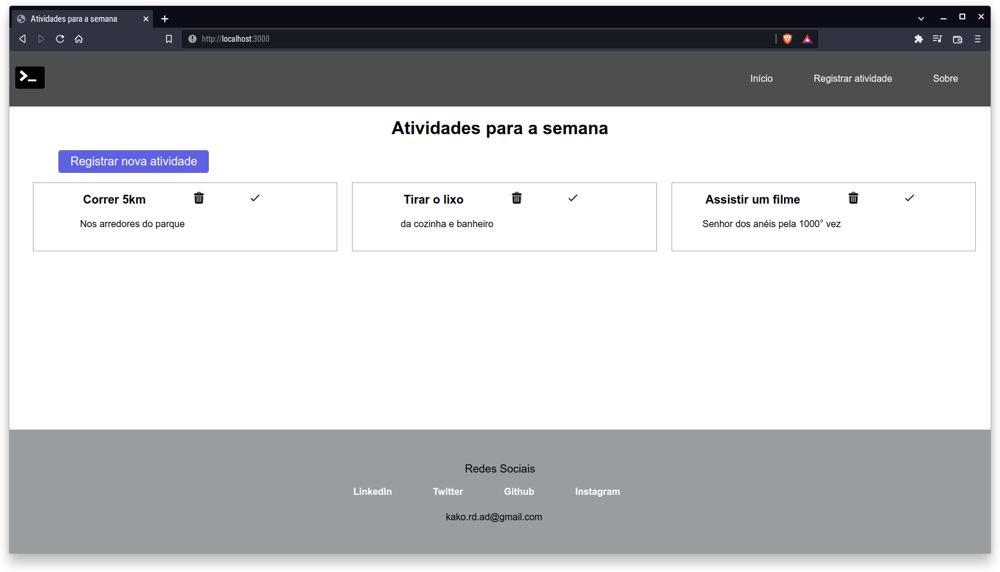
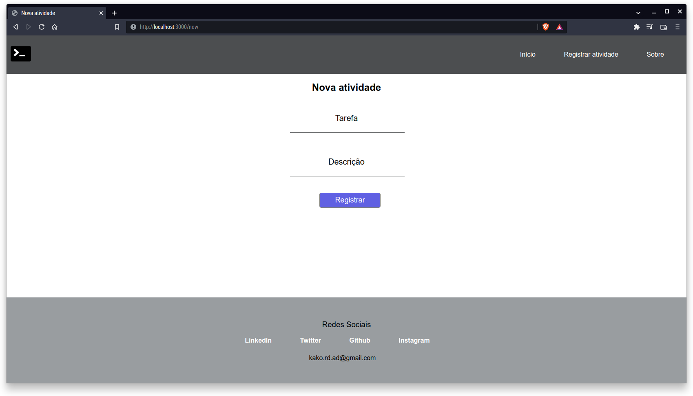
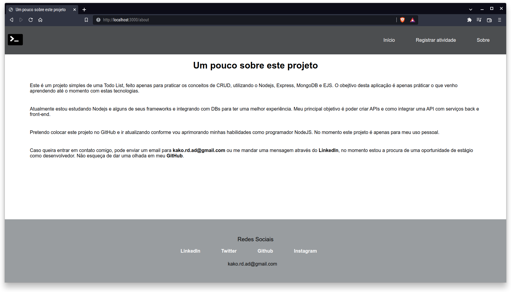

# To-do list com Express e mongodb

## PT-BR

#### Este é um simples projeto que criei para praticar a integração entre uma aplicação e o banco de dados. O banco de dados utilizado foi o Mongodb, o qual utilizei através de um container Docker.
#### Se você deseja rodar está aplicação em sua máquina é necessário que tenha o Docker instalado e o docker-compose. Qualquer problema pode entrar em contato comigo através do [LinkedIn](https://www.linkedin.com/in/kauealmeida99/), ou me mandar um email (kako.rd.ad@gmail.com).
#### A imagem do mongodb utilizada esta disponível neste [Link](https://hub.docker.com/repository/docker/almeidakaue/mongo-todo-db), é necessário fazer o download da imagem em sua máquina. Para rodar a aplicação tenha certeza que possui todas as dependências Docker instaladas, após isso, basta executar o comando docker-compose up no diretório em que se encontra o arquivo de compose.
#### Qualquer problema ou dúvida pode entrar em contato comigo.

## EN

#### This is a very simple todo list that I made for practice how to create a connection between an application and a database. I run the database through a Docker container using Mongodb.
#### If you would like to run that application at your device, make sure you have Docker and docker-compose installed. Any error or bug you can contact me on [LinkedIn](https://www.linkedin.com/in/kauealmeida99/) or by the email (kako.rd.ad@gmail.com).
#### The mongo image used it is available [here](https://hub.docker.com/repository/docker/almeidakaue/mongo-todo-db) you will need this image because the compose file was created using it. To run the full application make sure you have all the dependencies installed, after you check you can run the command docker-compose up at the directory you downloaded this small project.
#### Any trouble or doubt just get in touch.

### Tela inicial / Homepage

### Registro de atividades / New Task

### Sobre / About

